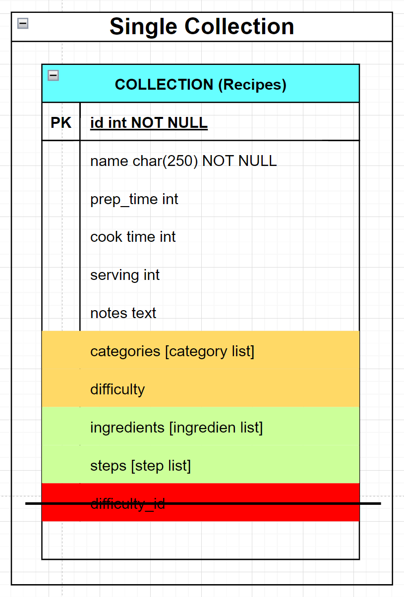
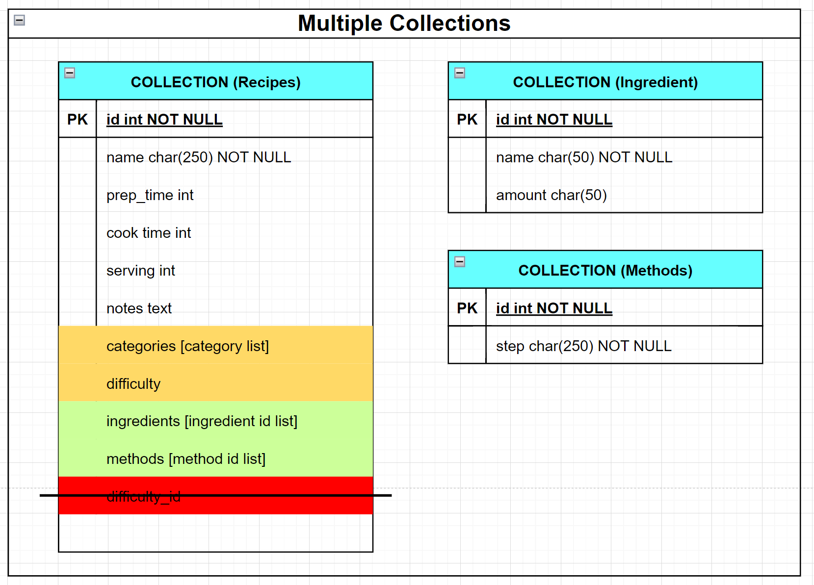

# Prep exercise week 4

---

## Exercise

### Question: What are the collections?

I have created two options for this exercise:

-  `Single Collection` Option
   -  Recipes
-  `Multiple Collections` Option
   -  Recipes
   -  Ingredients
   -  Methods

---

### Question: What information will you embed in a document and which will you store normalized?

#### `Single Collection` Option

##### Embedded Info

-  Categories
-  Difficulty
-  Ingredients
-  Steps

##### Normalized

-  None

#### `Multiple Collections` Option

##### Embedded Info

-  Categories
-  Difficulty

##### Normalized

-  Ingredients
-  Methods

---

## Discussion

### Question: What made you decide when to embed information? What assumptions did you make?

I decided to embed information when the field size is small. Assumptions:

-  The category list will not be too long.
-  There will be only 4 or 5 difficulty levels from easy to expert.
-  There will not be frequent updates.

I chose normalization when the field size is large. Assumptions for normalization:

-  There will be a long list of ingredients with many duplications, so I decided to separate it.
-  There will be many different methods with detailed explanations.
-  Both ingredients and methods will be frequently updated.

### Question: If you were given the choice between MySQL and MongoDB to build the recipe's database from the beginning, which one would you choose and why?

Initially, I would instinctively prefer MySQL because I feel more familiar with the structure and approach of relational databases.

However, if the fields (methods, ingredients, and recipes) are simple and I prioritize simplicity, I would prefer NoSQL.

On the other hand, if there are a large number of recipes with many ingredients and methods (for example, if I create a worldwide recipe application covering different cuisines), I would choose MySQL.
