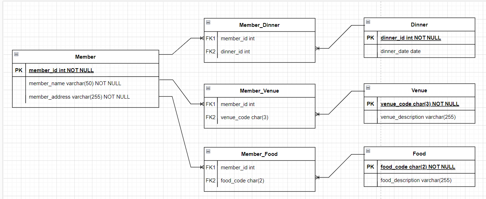

# 3.1. Exercise 1 : Normalization

---

## What columns violate 1NF?

-  `food_code` and `food_description` columns violate ==atomic value== rule.

-  `dinner_id` and `dinner_date` columns violate ==column domain== rule
-  `venue_code` and `venue_description` columns violate ==column domain== rule
-  `food_code` and `food_description ` columns violate ==column domain== rule

---

## What entities do you recognize that could be extracted?

Columns violating ==column domain== rule should be extracted from the table and new tables should be created accordingly. Following columns are violating this rule:

-  `dinner_id` and `dinner_date`,
-  `venue_code` and `venue_description`,
-  `food_code` and `food_description `.

And from these columns followint entities can be created seperately.

-  dinner
-  venue
-  food

---

## Name all the tables and columns that would make a 3NF compliant solution.

### Table Names:

-  member
-  dinner
-  venue
-  food

-  member_dinner
-  member_venue
-  member_food

### Column names for each table:

##### **member** table:

-  member_id
-  member_name
-  member_address

##### **dinner** table:

-  dinner_id
-  dinner_date

##### **venue** table:

-  venue_code
-  venue_description

##### **food** table:

-  food_code
-  food_description

##### **member_dinner** table:

-  member_id
-  dinner_id

##### **member_venue** table:

-  member_id
-  venue_code

##### **member_food** table:

-  member_id
-  food_code

---

### ERD

